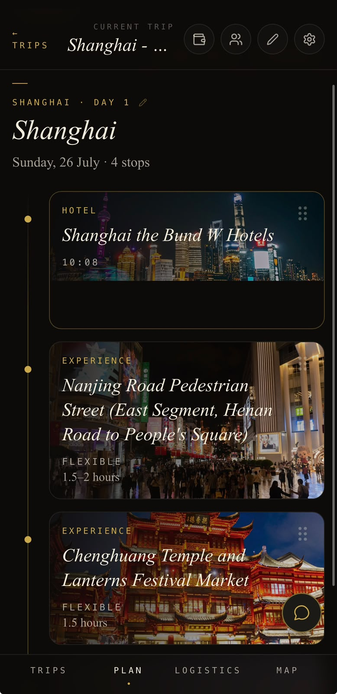
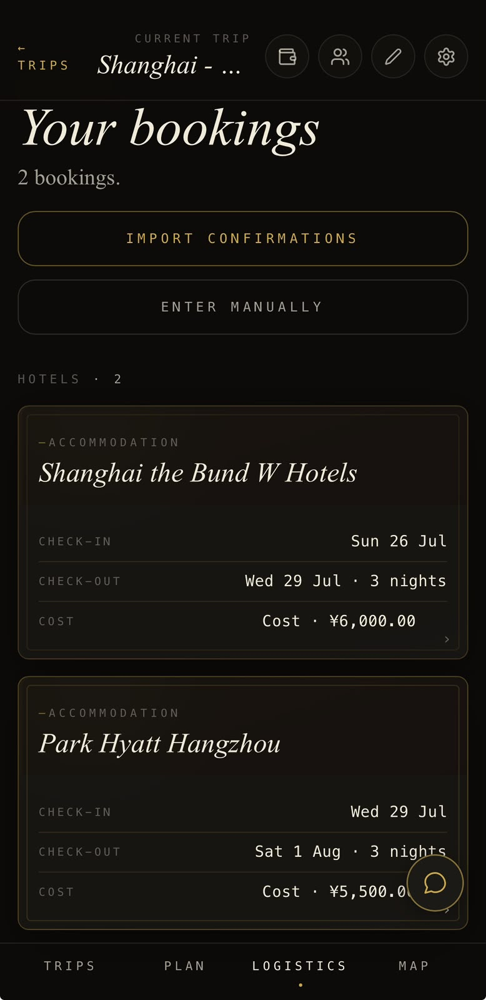
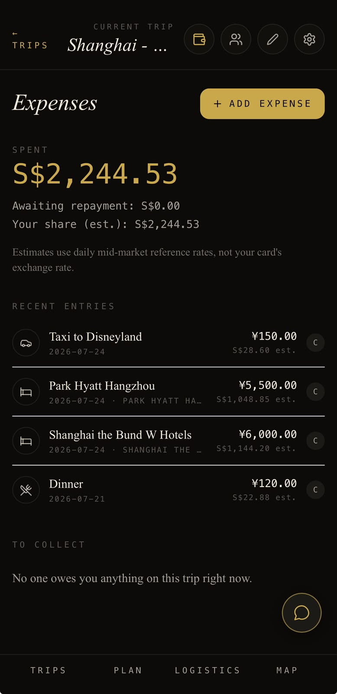

# Trippy

> The private travel dossier.

Not another dashboard. A calm, considered place for the bookings, ideas, details, and decisions that make a trip feel like yours.

Trippy turns the loose ends of travel planning into one living plan: the hotel confirmation, the place someone mentioned over dinner, the train you need to catch, the cost you promised to settle later. It stays flexible enough for a trip to change and clear enough to use when you are already on the move.

  

## The Trip, In One Place

Start with the fragments. Paste confirmation text, bring in screenshots or PDFs, and review the booking details before they become part of the trip. Flights, stays, trains, tickets, ferries, rentals, and the documents behind them all have a home.

Then make the plan your own. Build days around the places, meals, experiences, transit, and small practical notes that matter to you. Search for a place when you already know what you want; explore grounded suggestions when you do not. Move things around as the trip finds its shape.

## The Day, Composed

Plan is where a trip becomes a day you can actually follow. Timed or untimed stops, useful context, best-time guidance, photography, and map locations live together without turning the itinerary into a schedule you have to defend.

Confirmed travel can sit beside a long lunch, a market detour, or an evening you want to leave open. Transit stays in the background. The experiences are allowed to lead.

## The Practical Things, Close at Hand

Logistics keeps the operational side of the trip beautifully contained. A reservation can appear in the itinerary when it matters to the day, or wait in Logistics until you need it. Original import material and manually attached documents remain close to the booking they belong to.

  

## Spend Together, Without a Spreadsheet

Expenses is a private shared trip diary for the things that should not get lost in a group chat. Record spending in its original currency, link a cost to the booking it belongs to, and keep a simple note of who paid and who owes what.

The picture stays honest: what you paid, what is still owed back, and your estimated share in the trip's chosen currency. Original amounts remain visible. When an exchange-rate estimate is still pending, Trippy says so instead of quietly distorting the total.

  

## Ready When the Trip Begins

When the trip is live, Today brings forward what has happened, what is next, and where you are staying tonight. Map follows the selected day, keeps stops in order, and opens the navigation experience that fits the destination. Flight status is there when you choose to check it, not when an app decides to interrupt you.

The in-trip Co-Pilot is a second set of eyes, not an autopilot. It can search the trip's destination ideas, answer questions from the current plan, spot practical gaps, and propose changes. Every proposal stays visible for you to inspect, apply, or reject.

## Yours, and Only Yours

Trippy is invite-only. The people travelling can plan together in a private workspace, and the owner controls access. When you want to share the shape of the trip more widely, a revocable public link shows a clean, read-only itinerary—never booking confirmations, documents, expenses, co-pilot history, collaborator details, or editing controls.

## Deliberate by Design

Trippy makes room for judgement. It does not silently rearrange an itinerary, continuously poll flight data, provide offline editing, or pretend to be a payment service, accounting system, weather app, route optimiser, or social feed. It is a travel companion: personal, practical, and composed.

Designed for phone width first and ready to install to a home screen, Trippy carries the same warm near-black, cream, gold, and editorial character onto a larger screen—more room for the trip, never a different product.

## Project Documentation

For the product and engineering references behind Trippy, see:

- [`docs/superpowers/specs/2026-04-23-trippy-design.md`](docs/superpowers/specs/2026-04-23-trippy-design.md) — living product and architecture specification
- [`docs/superpowers/plans/`](docs/superpowers/plans/) — implementation history and explicitly unfinished work
